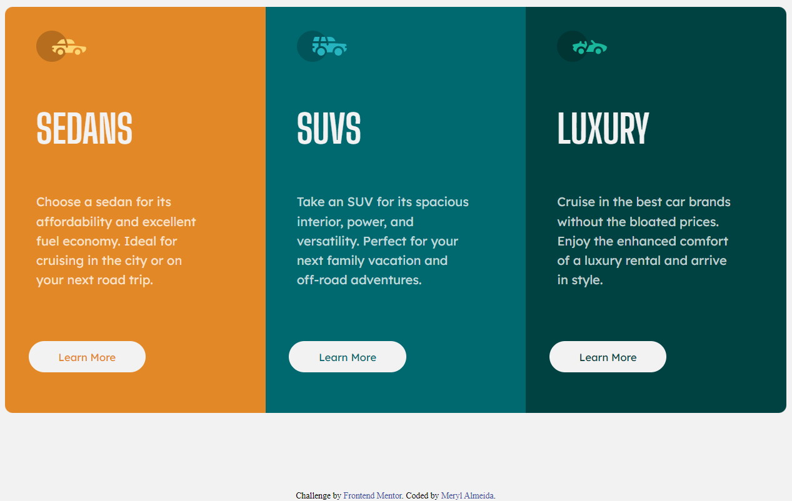

# Frontend Mentor - 3-column preview card component solution

This is a solution to the [3-column preview card component challenge on Frontend Mentor](https://www.frontendmentor.io/challenges/3column-preview-card-component-pH92eAR2-). Frontend Mentor challenges help you improve your coding skills by building realistic projects. 

## Table of contents

- [Overview](#overview)
  - [The challenge](#the-challenge)
  - [Screenshot](#screenshot)
  - [Links](#links)
- [My process](#my-process)
  - [Built with](#built-with)
  - [What I learned](#what-i-learned)
  - [Continued development](#continued-development)
  - [Useful resources](#useful-resources)
- [Author](#author)
- [Acknowledgments](#acknowledgments)

## Overview

### The challenge

Users should be able to:

- View the optimal layout depending on their device's screen size
- See hover states for interactive elements

### Screenshot

### Links

- Solution URL: (https://github.com/juanitatime/3-column-preview-card-with-HTML-and-CSS.github.io)
- Live Site URL: (https://brave-jackson-2bcf4a.netlify.app/)

## My process

### Built with

- Semantic HTML5 markup
- CSS custom properties
- Flexbox
- Mobile-first workflow

### What I learned

- Practiced using flexbox and looking at differences between using grid in creating the cards. 
- Learned how to add several breakpoints to create a responsive site. 
- Made sure to begin with mobile-design first so I could get used to it. 

### Continued development

Practicing when to use flexbox vs grid for layouts

### Useful resources

- [Resource 1](https://developer.mozilla.org/en-US/docs/Web/CSS/grid-template-columns) - The website helped me understand the concepts on grid template columns and whether or not to use them instead of flexbox. 
- [Resource 2](https://www.w3schools.com/colors/colors_converter.asp) - A helpful tool from W3 that converts hsl values to hex. 

## Author

- Website - [Meryl Almeida](https://www.malmeida.mystrikingly.com)
- Frontend Mentor - [@juanitatime](https://www.frontendmentor.io/profile/juanitatime)
- Github - [@juanitatime](https://www.github.com/juanitatime)

## Acknowledgments

Big thanks to Nam joo hyuk and BTS for inspiring me to continue working on this after feeling ill the day before. 
